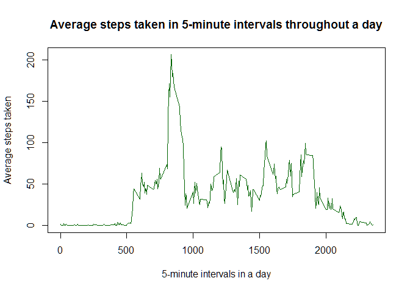
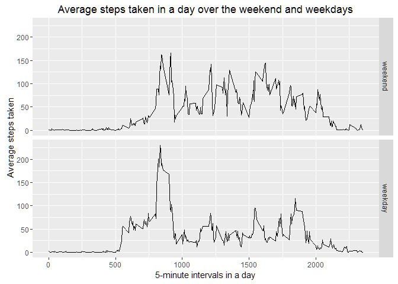

# Reproducible Research: Peer Assessment 1


## Loading and preprocessing the data

```r
#Set working directory where data is stored
setwd("C:\\Users\\212547167\\RepData_PeerAssessment1\\")
#Unzip file and get csv data
rawdata <- read.csv(unzip("activity.zip"))  
#Remove NA rows
mydata <- rawdata[complete.cases(rawdata),] 
#Disable scientific format of numeric values
options(scipen = 999)
```

## What is mean total number of steps taken per day?

```r
#Get the sum of steps taken each day for every date available
totalStepsAday <- aggregate(mydata$steps, list(Date = mydata$date), sum)
#Create histogram of total number of steps taken in a day
hist(totalStepsAday$x, main = "Histogram of total number of steps taken in a day", xlab = "Total steps taken in a day" ,col = "SteelBlue")
```

<!-- -->

```r
#Mean of total steps
meanSteps <- round(mean(totalStepsAday$x),digits=1)
#Median of total steps
medianSteps <- median(totalStepsAday$x)
```

The mean and median of the total steps taken in a day is 10766.2 and 10765 respectively.

## What is the average daily activity pattern?

```r
#Get the average steps taken in a 5-minute interval throughout a day for every date available
aveStepsAday <- aggregate(mydata$steps, list(Intervals = mydata$interval), mean)
plot(aveStepsAday, type = "l", main = "Average steps taken in 5-minute intervals throughout a day", ylab = "Average steps taken", xlab = "5-minute intervals in a day", col="DarkGreen")
```

<!-- -->

```r
maxInterval <- aveStepsAday[which.max(aveStepsAday$x),1]
```

The 5-minute interval with the maximum number of steps taken averaged across all the days in the dataset is 835.

## Imputing missing values
#Total number of rows with NA values

```r
totalMissingValues <- sum(is.na(rawdata))
```
The total number of rows with missing 'steps' data in the dataset is 2304.

The missing 'steps' values are replaced in the datasets with the corresponding average steps for that 5-minute interval.

```r
#Using the interval values in the raw dataset which have NA steps, get the indices of the corresponding interval values in the aveStepsAday array
indicesOfAveStepsAday = sapply(rawdata$interval[is.na(rawdata$steps)],function(x) which(aveStepsAday$Intervals==x))
#Replace the raw dataset values of NA by applying the indices found in aveStepsAday
rawdata$steps[is.na(rawdata$steps)]=sapply(indicesOfAveStepsAday, function(x) aveStepsAday[x,2])
#Plot the histogram of the total number of steps taken each day
newtotalStepsAday <- aggregate(rawdata$steps, list(Date = rawdata$date), sum)
hist(newtotalStepsAday$x, main = "Histogram of total number of steps taken in a day for filled dataset to replace NA", xlab = "Total steps taken in a day" ,col = "SteelBlue")
```

<!-- -->

```r
#Mean of total steps
newmeanSteps <- round(mean(newtotalStepsAday$x),digits=1)
#Median of total steps
newmedianSteps <- round(median(newtotalStepsAday$x),digits=1)
```

The mean and median of the total steps taken in a day for the filled dataset to replace NA is 10766.2 and 10766.2 respectively.  The mean for the filled dataset is the same as the dataset with NA ignored, but the median has changed in the filled dataset to match the mean value.  This is the outcome for replacing the NA values with the mean value in the filled dataset.

## Are there differences in activity patterns between weekdays and weekends?

```r
#Create a factor variable based on the filled dataset for weekdays and weekends
#Create a label for weekday days
weekdayDays <- c("Monday", "Tuesday", "Wednesday", "Thursday", "Friday")
#Change format of date in the dataset from factor to date
rawdata$date <- as.Date(rawdata$date)
#Create a new vector that describes a date either as weekday or weekend
dayType <- factor((weekdays(rawdata$date) %in% weekdayDays), levels = c(FALSE,TRUE), labels = c("weekend","weekday"))
#Add a new column to the rawdata dataframe for dayType
rawdata["dayType"] <- dayType

#Next, find the average steps taken over weekdays and weekend using 
newaveStepsAday <- aggregate(rawdata$steps, list(Intervals = rawdata$interval, DayType = rawdata$dayType), mean)

#Make a panel plot to show the difference in average steps taken over weekdays and weekends
library(ggplot2)
qplot(Intervals,x,data=newaveStepsAday,
      facets=DayType ~ .,
      geom = "line",
      ylab = "Average steps taken", 
      xlab = "5-minute intervals in a day",
      main = "Average steps taken in a day over the weekend and weekdays")
```

<!-- -->

The answer is "YES", there is an activity difference between the weekends and the weekdays.
